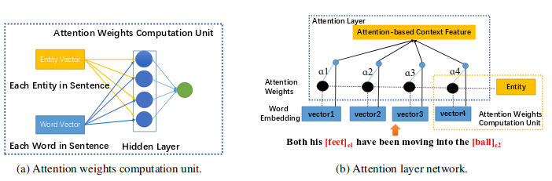

# Multilayer Perceptron Attention 

# [Embedded in AREkit-[0.20.0](https://github.com/nicolay-r/AREkit/blob/0.20.0-nldb-rc/networks/attention/architectures/mlp.py) and later versions]

> **UPD December 7rd, 2019:** this attention model becomes a part of 
[AREkit](https://github.com/nicolay-r/AREkit) framework
([original](https://github.com/nicolay-r/AREkit/blob/0.20.3-wims-rc/contrib/networks/attention/architectures/mlp.py),
[interactive](https://github.com/nicolay-r/AREkit/blob/0.20.3-wims-rc/contrib/networks/attention/architectures/mlp_interactive.py)). 
Please proceed with this framework for an embedded implementation.

This project is an unofficial implementation of MLP attention -- multilayer perceptron 
attention network, proposed by Yatian Shen and Xuanjing Huang 
as an application for **Relation Extraction Task**
[[paper](https://www.aclweb.org/anthology/C16-1238)].

Vector representation of words and entities includes:
* Term embedding;
* Part-Of-Speech (POS) embedding;
* Distance embedding;

## Application and Experiments
You may proceed with the following repositories
[NLDB-2020 paper/code](https://github.com/nicolay-r/attitude-extraction-with-attention);
[WIMS-2020 paper/code](https://github.com/nicolay-r/attitude-extraction-with-attention-and-ds).

This version has been embedded in AREkit-[0.20.3], and become a part of the following papers:

* Attention-Based Neural Networks for Sentiment Attitude Extraction using Distant Supervision 
[[ACM-DOI]](https://doi.org/10.1145/3405962.3405985) /
[[presentation]](docs/wims_2020_slides.pdf)
    * Rusnachenko Nicolay, Loukachevitch Natalia
    * WIMS-2020

* Studying Attention Models in Sentiment Attitude Extraction Task 
[[Springer]](https://doi.org/10.1007/978-3-030-51310-8_15) /
[[arXiv:2006.11605]](https://arxiv.org/abs/2006.11605) /
[[presentaiton]](docs/nldb_2020_slides.pdf)
    * Rusnachenko Nicolay, Loukachevitch Natalia
    * NLDB-2020

## References
* Attention-Based Convolutional Neural Network for Semantic Relation Extraction [[paper]](http://www.aclweb.org/anthology/C16-1238)
	* Yatian Shen and Xuanjing Huang
	* COLING 2016
